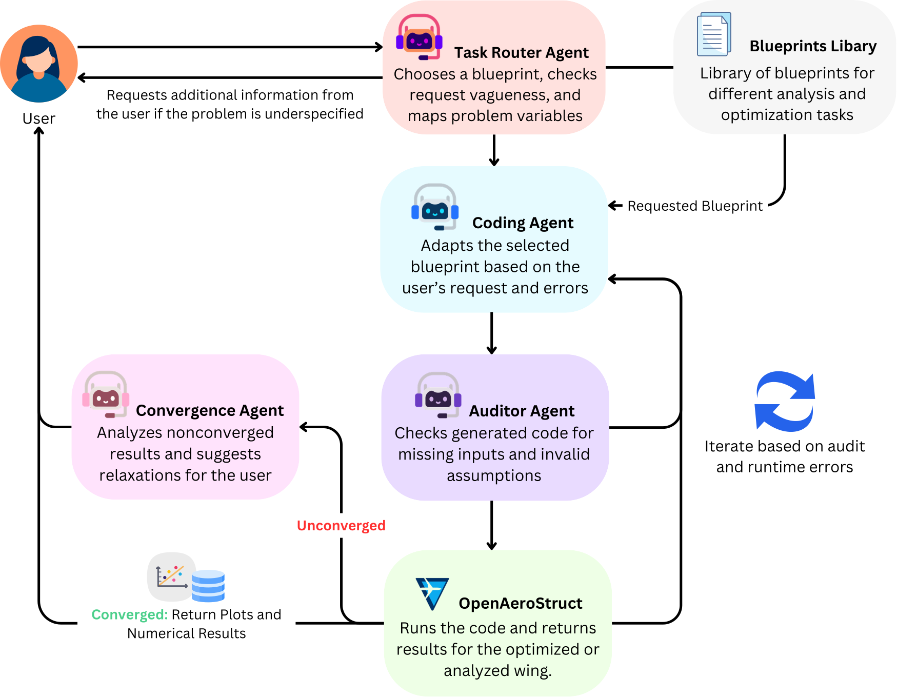

# OpenAeroStruct LLM Agent

A multi-agent framework that turns natural-language aircraft design requests into
OpenAeroStruct analyses and optimizations.



## What It Does

Describe a wing analysis or optimization in plain language. The agent selects
the right blueprint, generates and checks the code, runs OpenAeroStruct, and
returns plots and numerical results. If required information is missing, it
asks before running.

It supports:

- Aerodynamic analysis and optimization
- Structural optimization
- Aerostructural optimization with tube-spar or wingbox models
- Multipoint optimization

## Quick Start

Requires Python `3.12` and either a Gemini API key or a local Ollama model.

### 1. Install

```bash
uv sync --python-preference only-managed
```

Conda alternative:

```bash
conda create -n openaerostruct python=3.12
conda activate openaerostruct
pip install -e .
```

### 2. Choose an LLM Provider

Copy the environment template:

```bash
cp .env.example .env
```

For Gemini, add your [Google AI Studio key](https://aistudio.google.com/apikey)
to `.env`:

```bash
GEMINI_API_KEY="YOUR_GOOGLE_GEMINI_KEY"
```

For local use, install and start [Ollama](https://ollama.com/), then pull a model:

```bash
ollama pull llama3.1
```

### 3. Configure the Execution Environment

Generated OpenAeroStruct scripts can run in Docker or in the current Python
environment. For the Docker sandbox, build the image:

```bash
docker build -f docker/sandbox.Dockerfile -t openaerostruct-sandbox:latest .
```

Then set the backend in `.env`:

```bash
OAS_EXECUTION_BACKEND="docker"
```

Use `host` to run scripts in the current Python environment, or `auto` to use
Docker when it is available and otherwise fall back to the host.

### 4. Run the App

```bash
uv run streamlit run src/app.py
```

With Conda:

```bash
conda activate openaerostruct
streamlit run src/app.py
```

Choose a provider and model in the sidebar, then enter a request in the chat box.

## Example Prompts

Include the wing, flight condition, and desired result. For optimization, also
name the objective, design variables, and constraints.

- `Analyze a CRM wing at Mach 0.78 and 11,000 m. Sweep alpha from -2 to 8 deg and plot lift and drag.`
- `Minimize drag on a CRM wing at Mach 0.78 and 11,000 m. Vary alpha and twist, with CL = 0.5.`
- `Minimize fuel burn for a rectangular wing with a tube spar at Mach 0.45 and 4,000 m. Vary alpha, twist, and tube thickness. Constrain failure <= 0 and lift = weight.`

## Benchmarking

The benchmark runs from the command line so provider and model choices are
explicit and reproducible.

Gemini example:

```bash
conda activate openaerostruct
python src/benchmark.py --max-retries 5 --provider "Gemini API" --model "gemini-flash-lite-latest"
```

Ollama example:

```bash
conda activate openaerostruct
python src/benchmark.py --max-retries 5 --provider "Ollama" --model "llama3.1"
```

`--max-retries` sets the maximum number of coding attempts used to recover from
audit and execution failures.

Outputs are written under `benchmark_run_out/`.

If a benchmark is interrupted, resume it in the same output directory with:

```bash
python src/benchmark.py --resume-run run_YYYYMMDD_HHMMSS_model-name
```

The runner restores the configuration from `run_metadata.json`, skips completed
repetitions in `rep_results.csv`, and restarts incomplete repetitions.

### Case Study 3 rerun

The paper Case Study 3 experiment uses a fixed custom prompt with automatic
approval of Convergence Agent recommendations. Run five repetitions with:

```bash
conda activate openaerostruct
python src/benchmark_case3.py --num-reps 5 --max-retries 5 --max-convergence-tries 3 --provider "Gemini API" --model "gemini-flash-lite-latest"
```

Outputs are written under `benchmark_run_out/run_*_framework_case3_*`. The
paper-specific summary file is `case3_results.csv`, which records auditor loops,
convergence approvals, and final fuel-burn objective values for each repetition.

## Reference

The related preprint is available from the [University of Michigan Deep Blue
repository](https://backend.production.deepblue-documents.lib.umich.edu/server/api/core/bitstreams/1986c947-bc2b-4a9b-9a3e-2ee66df5d98c/content)
and the [IDEAS Lab website](https://www.gokcincinar.com/software/openaerostruct/).

## Contributors

- **Conan Lee**: lead developer and primary author (HKUST)
- **Gokcin Cinar**: research supervision and concept development (U-M)
- **Joaquim R. R. A. Martins**: research supervision and concept development (U-M)

## Citation

If you use this project, please cite the related preprint:

```bibtex
@misc{lee2025aerodynamic,
  title = {Aerodynamic Design and Optimization via a Specialized Agentic Generative AI Framework},
  author = {Lee, Conan and Cinar, Gokcin and Martins, Joaquim R. R. A.},
  year = {2025},
  doi = {10.7302/26722},
  url = {https://dx.doi.org/10.7302/26722}
}
```

## License

Copyright 2025-2026, The Regents of the University of Michigan, IDEAS Lab, MDO Lab

[University of Michigan IDEAS Lab](https://ideas.engin.umich.edu)

Released under the terms in [LICENSE](./LICENSE).
